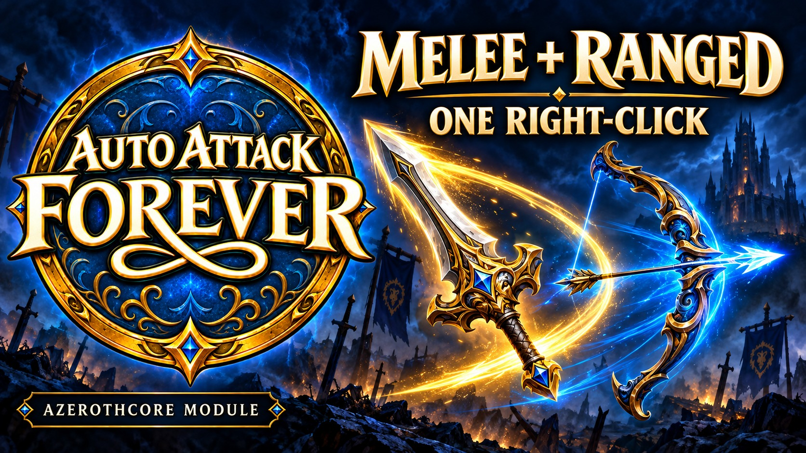

# Auto-Attack Forever

Created by [CWO4PapaBear](https://github.com/CWO4PapaBear). Third-party contributions are credited in [THIRD_PARTY_NOTICES.md](THIRD_PARTY_NOTICES.md).

Your most basic attacks should be the easiest part of combat. Switching between shooting and swinging is a small, familiar frustration—easy to overlook, but repeated across countless encounters. **Auto-Attack Forever** smooths out that friction, letting your equipped weapons handle the basics while you focus on the abilities, timing, and big plays that make your character fun to play.

Close the distance. Take the shot. Save your attention for the moves that matter.

For hunter-style characters in Free Pick or Wildcard systems, universal ranged attacks can also leave more room for specialization. When Auto Shot would otherwise consume an ability selection, making basic ranged attacks available to everyone lets that selection go toward another skill that defines the build. Spend it on becoming a better marksman, a stronger beast master, or something entirely your own.

This module supplies the basic attack controls; it does not itself refund ability selections or change a Free Pick/Wildcard system's ability pool. That system must treat the supplied attack as free to realize this benefit. Ordinary hunters keep their existing abilities, and all classes retain their normal weapon restrictions.

**0.2.0 preview — no core edits required. Built and tested on stock AzerothCore on September 15, 2026.**

Auto Ranged dispatches native Auto Shot (75) for bows, guns and crossbows on every class, without teaching or requiring a separate Auto Shot ability. It preserves native Hunter proc identity without granting talents or the Hunter's separate haste passive. Thrown weapons and wands fire automatically and switch between melee and ranged. Wands retain stock startup timing.

Upgrading from a core-patched version? Follow [the migration instructions](docs/UPGRADE-0.2.0.md) before rebuilding. Do not leave the old core callbacks installed alongside this version.

Right-click an enemy to use the equipped ranged weapon outside melee reach and melee attacks at close range. If the target moves back into valid ranged distance, ranged attacks resume. The General spellbook contains **Auto Melee** and **Auto Ranged**; the optional addon changes Auto Ranged's icon to the equipped ranged weapon on Blizzard action bars.

Supports bows, guns, crossbows, thrown weapons and wands. Existing proficiency, ammunition, durability, range, facing, line-of-sight and movement checks still apply. Every character receives the attack controls, regardless of class or weapon proficiency. The module does not teach weapon skills, remove item class restrictions, or make a weapon equippable by an otherwise ineligible character.

## Demonstration

[Watch the showcase on YouTube](https://youtu.be/Dh1eWCPZBXg). The downloadable package also includes the original final-test MP4.

Recorded by the project owner during the successful final test on the Classless test server. This recording demonstrates the working predecessor. The packaged preview subsequently passed its stock-core build, activation and ordinary-class gameplay tests on September 14, 2026. The video is provided as a separate media asset, not under the source-code license.

Click the header thumbnail to watch the showcase.

The display name is **Auto-Attack Forever**. Installation folder and configuration identifiers remain `mod-adaptive-autoattack` and `AdaptiveAutoAttack.Enable` in this preview.

## Components

- `src/`: independent server module, no Classless Wildcard dependency.
- `patches/`: historical migration references only. **Do not apply them with 0.2.0.**
- `data/sql/db-world/`: three custom spell records and General-tab mappings.
- `tools/build_client.py`: generates client patches from your own 3.3.5a client; preserves unrelated entries in existing Z archives.
- `client-addon/AdaptiveAutoAttack/`: optional dynamic action-bar icon addon.
- `conf/`: enable/disable setting.

The server module uses existing AzerothCore hooks; **no core patch is required**. Matching client spell data is still required. No Blizzard client assets, account data, databases, executable files or server credentials are included.

## Installation

Start with the [step-by-step walkthrough](docs/INSTALL.md). It assumes you already have a running AzerothCore server. The helper `tools/prepare_server.py` performs read-only checks and never patches the core.

Install the repository at `modules/mod-adaptive-autoattack`, check IDs, rebuild your worldserver, apply the included SQL once through your normal module updater, and generate matching client patches from your own client. Existing installations retain their spell records and client patches.

Tested core revision: `e1823bb2db751a7cc0a90a8543e778449ebf7d84`. Other revisions require compilation and gameplay validation. Keep backups and test before deploying to a public realm.

## Verification and limits

The hook-based server compiled and linked against unmodified stock AzerothCore and passed user-reported testing of bows, guns, crossbows, thrown weapons and wands, automatic repetition and melee/ranged switching on September 15, 2026. The C++ files are byte-identical to that tested build; its startup message still says `no-core prototype 1; stock wand timing`.

Native Auto Shot/Wild Quiver interaction was separately verified on the preceding modified-core build: 117 Wild Quiver damage events followed 831 damaging Auto Shots with rank 3 reported by the tester. This demonstrates proc operation, not an exact measured 12% probability. A new Hunter-proc trace on the hook-based version remains an additional check. See [validation](docs/VALIDATION.md).

There is a short transition window to distinguish a client response to a server-requested mode change from a stop request. High-latency and packet-loss testing is outstanding. Do not advertise competitive-PvP readiness yet.

Native spell IDs are preserved, including existing Shoot, Throw and wand abilities. The two custom implementation spells are hidden in the client. Action-bar replacement addons and non-enUS labels have not been tested. Built-in melee activation and right-click share an attack command; a separate manual melee-only override is not implemented.

## Disable or uninstall

Set `AdaptiveAutoAttack.Enable = 0` and restart to stop automatic dispatch and new grants. This retains learned spells and client labels. For a complete rollback, stop the server, restore the prior core/module build and database backups, restore both prior client archives and remove the addon. Version 0.2.0 has no core patch to remove. Older installations must remove their old integration as described in the migration guide.

## License

GPL-2.0-or-later. Bundled client archive utilities are adapted from `mod-classless-wildcard`; see [third-party notices](THIRD_PARTY_NOTICES.md). Generated client patches are for your own installation and are intentionally excluded from this source repository.
