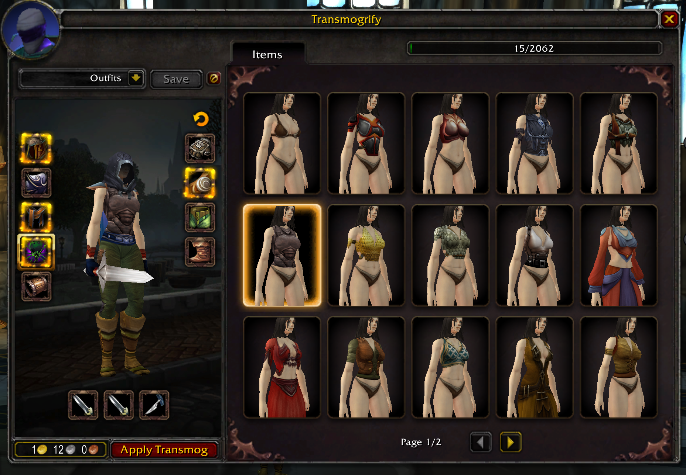
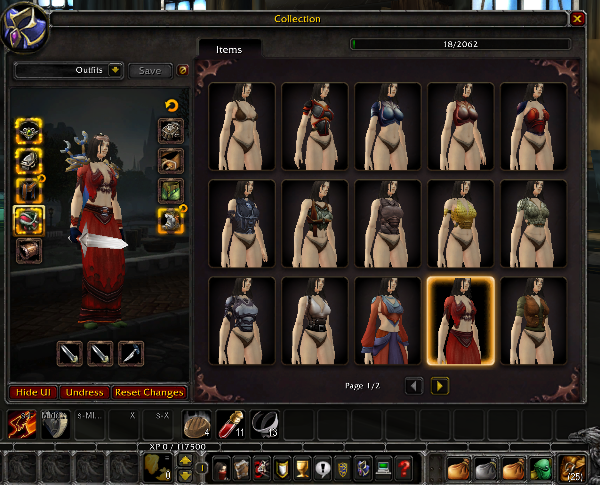

# mod-transmog-plus

Slot-based transmogrification module for [AzerothCore](https://github.com/azerothcore/azerothcore-wotlk) based on [azerothcore/mod-transmog](https://github.com/azerothcore/mod-transmog). The main difference is that appearances are stored per `(player, equipment slot)` instead of per item GUID, so the look stays when you swap gear. Other players see the transmogged appearance through the standard visible-item update hooks.

Features:

- Slot-based transmog — appearances stay on the equipment slot when you swap gear.
- Account-wide collection — any appearance unlocked by one character is available to all characters on the account.
- Appearances unlock when you equip an item, not when it enters your inventory.
- Option to hide individual armor slots (helm, shoulders, chest, etc.).
- Empty-slot pre-transmog — Allows queuing an appearance on a slot before equipping gear. The look is purely stored and will not render while the slot is empty; it automatically activates only when a compatible item is placed in that slot. Incompatible items will simply render normally.

This fork uses the addon from [cmangos-transmog](https://github.com/flekz-games/cmangos-transmog) to provide a better experience for the player. You will still be able to use the transmogrifier without the addon present, the standard gossip ui is used as fallback. Each slot has a "hidden" transmog template without the need to collect any item for it. 100% AI slop code!



Also comes with a collection addon that swaps the rdf tool for a transmog collection.



## Installation

1. Place the module under the `modules/` folder of your AzerothCore source directory. You can clone it directly using git:

   ```bash
   cd path/to/azerothcore/modules
   git clone https://github.com/Stefan2102/mod-transmog-plus-ui.git
   ```

2. Manually import the SQL files to the correct databases (`acore_characters` and `acore_world`).

3. Re-run CMake and launch a clean build of your AzerothCore server to compile the module.

4. Copy `conf/mod_transmog_plus.conf.dist` to `mod_transmog_plus.conf` and adjust values as needed.

5. After the server starts, log in with a GM account, go to your desired location, and spawn the Transmog NPC using this command:

   ```text
   .npc add 190012
   ```
6. Optionally install the client addon. Duh.

## Configuration

All prices, quality requirements, type restrictions, and requirement ignores are configurable in `mod_transmog_plus.conf`. See the distributed config file for details.

## Known Limitations

- **Hidden slot icon:** When a slot is set to hidden, the character-sheet icon becomes invisible rather than showing an empty slot icon. This is a side effect of using a non-existent item entry as the hidden sentinel, which is needed to fix the unequip refresh bug.
- **Set bonus counter:** Transmogging an item that belongs to an equipment set causes the client to show the wrong count (e.g. 5/6 instead of 6/6). The set bonus still functions correctly — the counter is a display-only issue.

## Credits

[flekz-games](https://github.com/flekz-games) -> [cmangos-transmog](https://github.com/flekz-games/cmangos-transmog)
[Stefan2102](https://github.com/Stefan2102) -> [mod-transmog-plus](https://github.com/Stefan2102/mod-transmog-plus)
[flekz-games](https://github.com/flekz-games) -> [cmangos-transmog](https://github.com/flekz-games/cmangos-transmog).
[Stefan2102](https://github.com/Stefan2102) -> [mod-transmog-plus](https://github.com/Stefan2102/mod-transmog-plus).

## License

GNU Affero General Public License v3 — see `LICENSE`.
